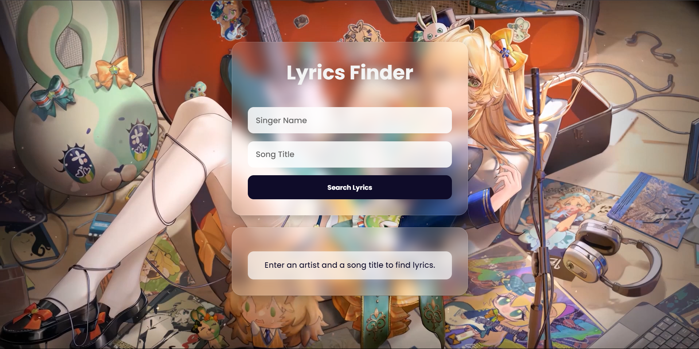
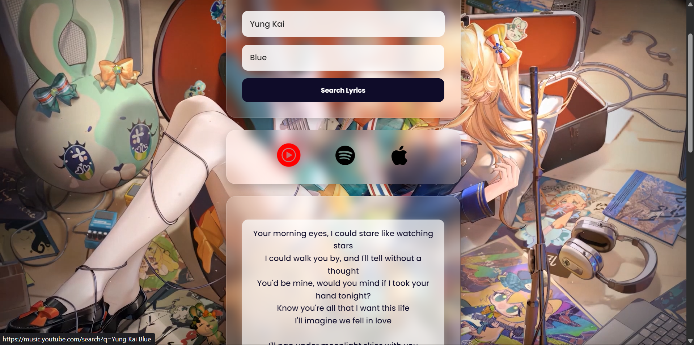

# 🎵 Find My Lyrics

A sleek and modern web app that lets users **search for song lyrics** and access the song on platforms like **YouTube Music, Spotify, and Apple Music**. Crafted with ❤️ using HTML, CSS, and JavaScript.

---

## 🚀 Features

- 🔍 Search any song by artist and title (only english songs)
- 🎤 Get full lyrics fetched via [Lyrics.ovh API](https://lyrics.ovh/)  
- 🔗 Direct links to listen on:
  - YouTube Music
  - Spotify
  - Apple Music  
---

## 🖼️ Screenshots

### 🔹 Initial View
What the user sees when the app is first loaded:



---

### 🔹 Lyrics Result View
After entering the artist and song name, the lyrics are fetched and displayed along with music platform links:




---

## 🛠 Tech Stack

- **HTML5**
- **CSS3**
- **JavaScript (Vanilla)**
- **API**:
  - [Lyrics.ovh](https://lyrics.ovh/)

---

## 📦 Setup

Clone the repository and run the html file:
```bash
https://github.com/RupenParthu/find-my-lyrics
cd find-my-lyrics

